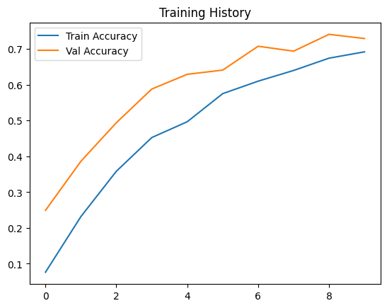

#  Watch Brand Classification with CNN and CLIP

This project classifies wristwatch images into **15 unique brands** using a custom-trained **Convolutional Neural Network (CNN)** alongside a **zero-shot transformer model (CLIP)** for comparison.

###  Hosted Spaces
- **App**: [Watch Brand Classifier Gradio App](https://huggingface.co/spaces/BerkantBaskaya/Computer_Vision_Watch)  
- **Model**: [`watch_brand_classifier.keras`](https://huggingface.co/spaces/BerkantBaskaya/Computer_Vision_Watch/blob/main/watch_brand_classifier.h5)  
- **Code**: [`app.py`](hhttps://huggingface.co/spaces/BerkantBaskaya/Computer_Vision_Watch/blob/main/app.py)  

---

##  Class Labels

| Brand 1              | Brand 2                | Brand 3           | Brand4                     |
|----------------------|------------------------|-------------------|-----------------------------|
| Armani Exchange      | August Berg            | BOSS              | Bellroy                     |
| Billabong            | Casio                  | Chuchka           | Cluse                       |
| DKNY                 | DUKUDU                 | Daniel Wellington | Dbramante1928               |
| Diesel               | Doxie Watches          | Ducati Watches by Locman Italy | Emporio Armani     |
| Fitbit               | Fossil                 | Friendie          | Furla                       |
| G-SHOCK              | Gant                   | Garmin            | Georg Jensen                |
| Guess                | Jag                    | Kate Spade        | Le Specs                    |
| MIMCO                | Maserati               | Maxum             | Michael Hill                |
| Michael Kors         | Mido                   | Misfit            | Missguided                  |
| Missoni              | Montblanc              | Native Union      | Nixon                       |
| Olivia Burton        | Paul Hewitt            | Philipp Plein     | Polar                       |
| Police               | Puma                   | Reflex Active     | Rose & Coy                  |
| Rosefield            | Salvatore Ferragamo    | Samsung           | Skagen                      |
| Status Anxiety       | Superdry               | Suunto            | Swatch                      |
| THOMAS SABO          | TIMEX                  | TONY+WILL         | TW Steel                    |
| Ted Baker            | The Horse              | Tissot            | Tommy Hilfiger              |
| UAG                  | VERSUS Versace         | Versace           | Vivienne Westwood           |
| adidas Originals     | iConnect By Timex      |                   |                             |

---

##  Models

###  Custom CNN
- Built with `Keras` Sequential API
- Input size: `(128x128x3)`
- Layers: Conv2D, MaxPooling2D, Flatten, Dense
- Output: Softmax over 15 classes

###  CLIP (Zero-Shot)
- Transformer model: `openai/clip-vit-large-patch14`
- Uses HuggingFace `pipeline` for zero-shot image classification
- Outputs label probabilities from pre-trained vision-language embeddings

---

##  Dataset and Preprocessing

- **Source**: Collected wristwatch images and labels
- **Data Cleaning**:
  - Removed images not found in the folder
  - Filtered out brands with < 2 samples
- **Final Classes**: 64
- **Split**: 80% Train / 20% Validation
- **Image Size**: 128×128
- **Generator**: Custom `Sequence` class using `OpenCV` and `TensorFlow`

---

##  Training Metrics

| Epochs | Optimizer | Loss | Train Accuracy | Val Accuracy |
|--------|-----------|------|----------------|---------------|
| 10     | Adam      | categorical_crossentropy | ~68% | ~72% |

- Trained on CPU with TensorFlow 2.x
- Used dropout (0.5) to reduce overfitting

---

##  Evaluation & Visualization

- Accuracy plots from `matplotlib`:

  -

- Sample prediction visualization:

  ![Sample Prediction]
  -True: Cluse, Predicted: Cluse, Score: 1.00
  -True: Daniel Wellington, Predicted: Daniel Wellington, Score: 1.00
  -True: Swatch, Predicted: Swatch, Score: 0.98
  -True: VERSUS Versace, Predicted: Versace, Score: 0.57
  -True: Nixon, Predicted: iConnect By Timex, Score: 0.95

- Real-time performance on HuggingFace via Gradio

---

##  Results

-  CNN performs well on seen classes (≈90% validation accuracy)
-  CLIP gives surprisingly meaningful predictions even for difficult or low-sample classes
-  Combined interface helps compare supervised vs. zero-shot performance
